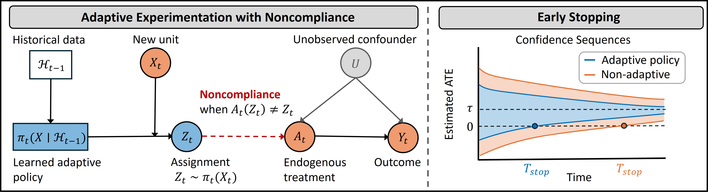

# Efficient Adaptive Experimentation with Noncompliance



**TL;DR:**
We develop AMRIV, an adaptive, multiply robust estimator for average treatment effect (ATE) estimation when treatment can only be encouraged via a binary instrument. Our method learns an optimal, covariate-dependent assignment policy that minimizes estimator variance, and pairs it with a sequential influence-function–based estimator that is both semiparametrically efficient and robust to nuisance misspecification. We also provide time-uniform asymptotic confidence sequences and validate the approach in synthetic and semi-synthetic experiments.

Replication code for [Efficient Adaptive Experimentation with Noncompliance](https://arxiv.org/abs/2505.17468).

## Replication Code for Paper

Use the following commands to replicate the figures from the "Efficient Adaptive Experimentation with Noncompliance" paper:

* For Figure 2 & 3: ```python run_synthetic.py```

* For Figure 4: ```python run_semi_synthetic.py```